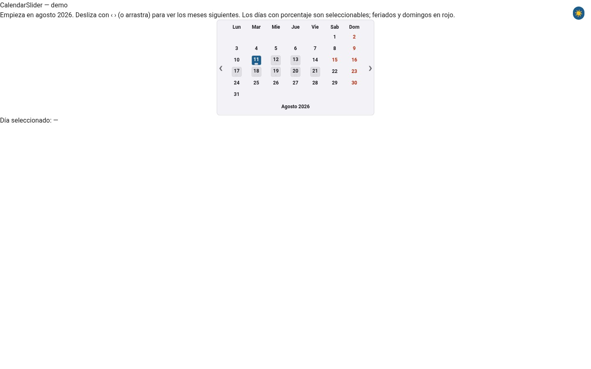
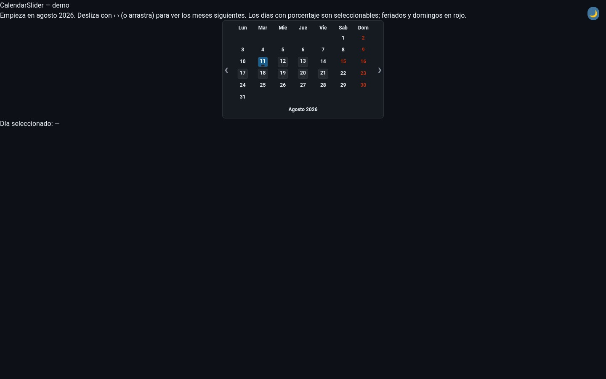
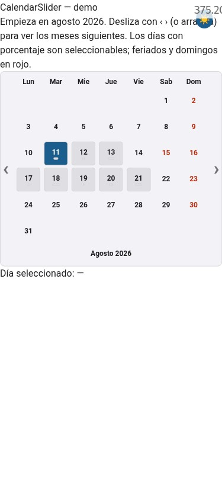
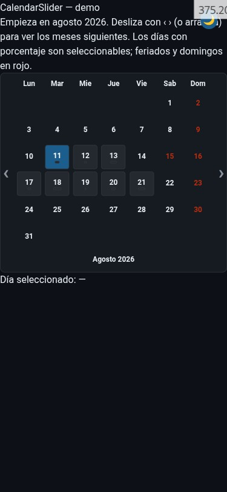

# CalendarSlider

Declarative, JavaScript-free month calendar: one month visible at a time, sliding to its neighbors, with holidays, occupation percentage, today marker, and single-day selection — all signal-driven.

## Features

- One month on screen at a time, starting at `Start` (default: today's month) and sliding forward through up to `NumMonths` (max 12) consecutive months. ‹ › are `<button>`s; a small click handler (`slideToMonth`) jumps the scroll-snap strip to the neighbouring month card with `ScrollIntoView`, and the browser's scroll-snap animates it. They are deliberately **not** `<a href="#cs-m-...">`: an anchor mutates `location.hash`, which a hash-routed shell (`platformd`) reads as a route change, blanking the view. No rebuild, no JS.
- Week starts Monday; Sunday and holidays render red (Danger), matching the original component. Each month carries its own weekday header and a month name label below it, like the original's `footer-title-month`.
- Occupation days (`Occupation []OccupationDay`) are selectable and show a `N%` bar (`data-use`) plus `title="N%"`; values clamp to 0–100.
- Today's date is marked with a Today style and `title="Hoy"`.
- Selected day is a `*dom.SignalString` (`YYYY-MM-DD`) written by the host or by clicking a bookable day; the DOM patches in place via `BindState(widget.Selected, ...)` — no full re-render.
- `OnSelect` callback fired on click, in addition to the signal.
- Accessible: `role=grid`/`row`/`gridcell`/`columnheader`, `aria-selected`, `aria-hidden` filler cells, labeled navigation buttons.
- Light/dark out of the box: every color comes from theme tokens (`light-dark()`-aware), so the calendar follows whatever `data-theme` the app sets — pair it with `webtyp/components/themetoggle` for a user-facing switch.
- Mobile-aware: the single-month-at-a-time layout already fits a phone; the only device-specific rule grows the day cell to a more comfortable touch target — no JS, pure `On(css.Mobile, ...)`.

## Usage

```go
import "webtyp.com/components/calendarslider"

cal := &calendarslider.CalendarSlider{
    Start:     "2026-08", // first month of the strip (defaults to today's month)
    NumMonths: 3,         // how many months forward from Start are slidable (max 12)
    Holidays:   []calendarslider.Holiday{{Date: "2026-08-15", Name: "Asunción de la Virgen"}},
    Occupation: []calendarslider.OccupationDay{{Date: "2026-08-11", Percent: 60}},
    OnSelect: func(date string) {
        fmt.Printf("selected: %s\n", date)
    },
}
cal.Init(dom.NewCtx(...))
dom.Render("app", cal.Render())

// Host-driven selection:
cal.Selected.Set("2026-08-11")
```

## API

### CalendarSlider Struct

- `Start string`: Month key `YYYY-MM`, the first (leftmost) month of the strip; empty means the current month. There is nothing to slide to before `Start` — like the original, this is built for booking forward, not browsing past months.
- `NumMonths int`: How many consecutive months forward from `Start` are slidable (default 3, max 12).
- `Holidays []Holiday`: `{Date, Name string}`; `Date` is `YYYY-MM-DD`, shown as the day's `title` and rendered red. Slice, not a map — TinyGo.
- `Occupation []OccupationDay`: `{Date string; Percent int}`; `Percent` clamps to 0–100. A date's presence in the list makes that day selectable. Slice, not a map — TinyGo.
- `Selected *dom.SignalString`: Two-way selection signal (`YYYY-MM-DD`); write it to select programmatically.
- `OnSelect func(date string)`: Callback fired when a bookable day is clicked.

### Signals

- `Init` seeds `Selected` with `dom.NewString("")` when nil — safe to use before any interaction.

## Screenshots

The `web/` demo (`Start: "2026-08"`, the same sample holidays/occupation shown in Usage, plus `themetoggle`) in all four combinations of theme and viewport:

| Light | Dark |
|---|---|
|  |  |
|  |  |
